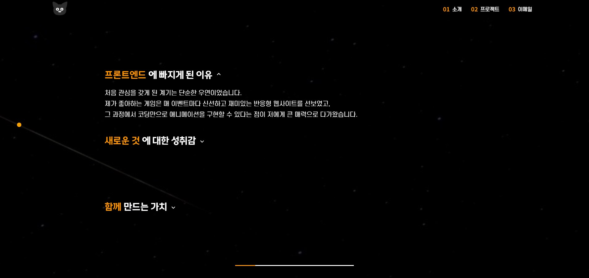
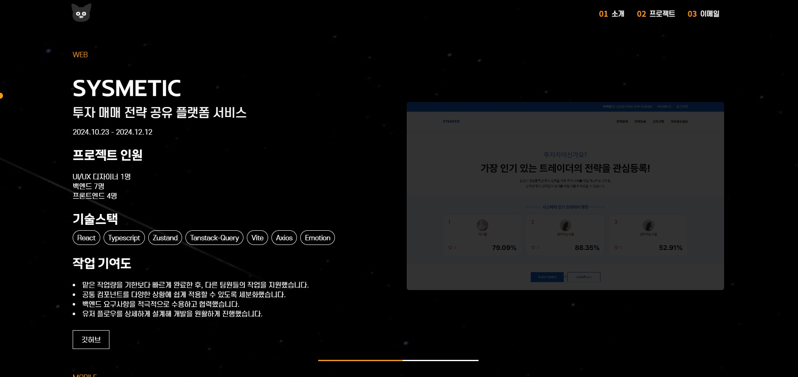
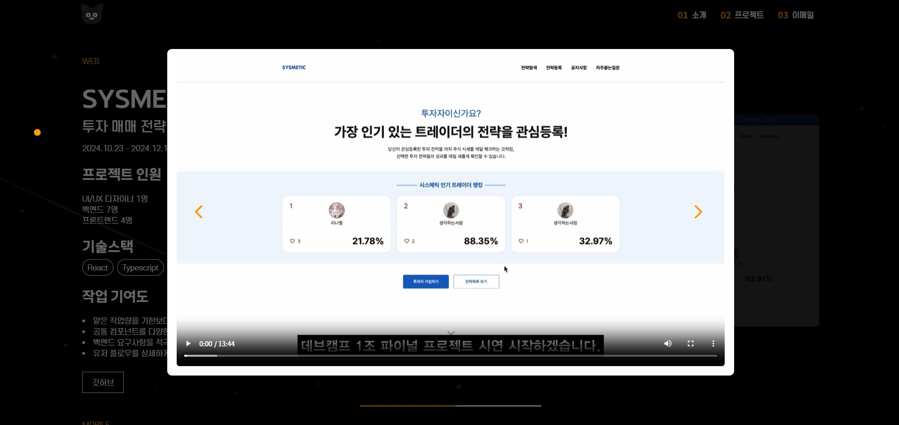
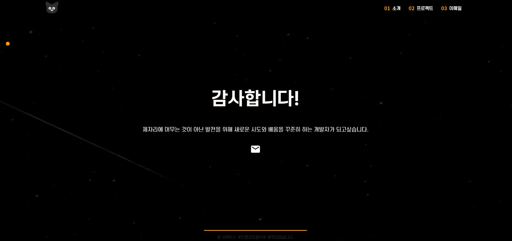

# 포트폴리오 웹사이트

포트폴리오용으로 제작된 웹사이트 입니다.

아래의 링크를 클릭 시, 포트폴리오 사이트로 이동됩니다.

[포트폴리오 보러가기](https://portfolio-lovat-zeta-79.vercel.app/)

---

# 프로젝트 규모
개인 프로젝트

# 개발 기간 및 작업 관리
- 전체 개발 기간 : 2024.12.19 - 2025.01.06

- 기획 및 디자인 : 2024.12.19 - 2025.01.23

- 페이지 퍼블리싱 : 2024.12.24 - 2025.01.28

- 기능 구현 : 2024.12.28 - 2025.01.06

---

## 페이지

### 1. 메인 섹션
- 헤더의 고양이아이콘을 클릭하면 맨 위 상단으로 이동됩니다.

- 헤더의 메뉴를 클릭하면 각 센션으로 이동됩니다.

- 부드러운 애니메이션 처리로 즐거움을 추가하였습니다.

### 2. 소개 섹션
- 화살표 아이콘을 클릭하면 content 영역이 열리며 내용을 확인할 수 있습니다.

### 3. 프로젝트 섹션
- '깃허브' 버튼을 클릭하면 해당 프로젝트의 깃허브 사이트로 새 탭 이동됩니다. (웹사이트 버튼은 해당 프로젝트의 웹사이트로 이동됩니다. 시스메틱은 웹사이트가 존재했지만 회사측에서 도메인을 삭제하여 현재는 진입이 불가능한 상태입니다.)

- 이미지 클릭 시 모달이 열리며, 화살표 아이콘을 클릭하여 다른 이미지 혹은 비디오를 확인할 수 있습니다.

### 4. 이메일 섹션
- 이메일 아이콘 클릭 시 연동되어있는 이메일로 바로 이메일 보내기가 가능하도록 되어있습니다.

# 기술 스택
- Front : React, Typescript, Vite, emotion, styled-components, Zustand

- Back-end : Firebase

- 버전 및 이슈관리 : Github, Github Issues

- 서비스 배포 환경 : Vercel

- 디자인 : Figma